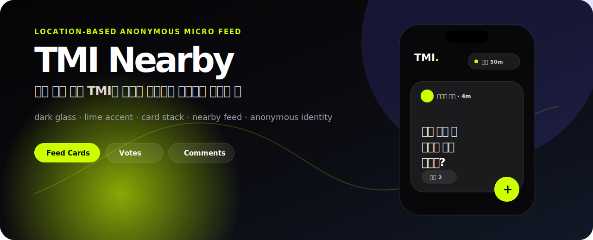
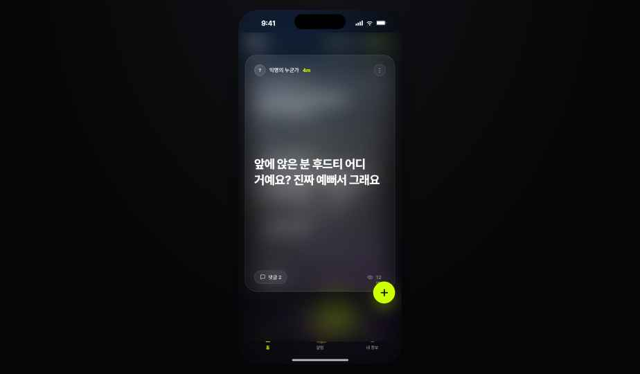
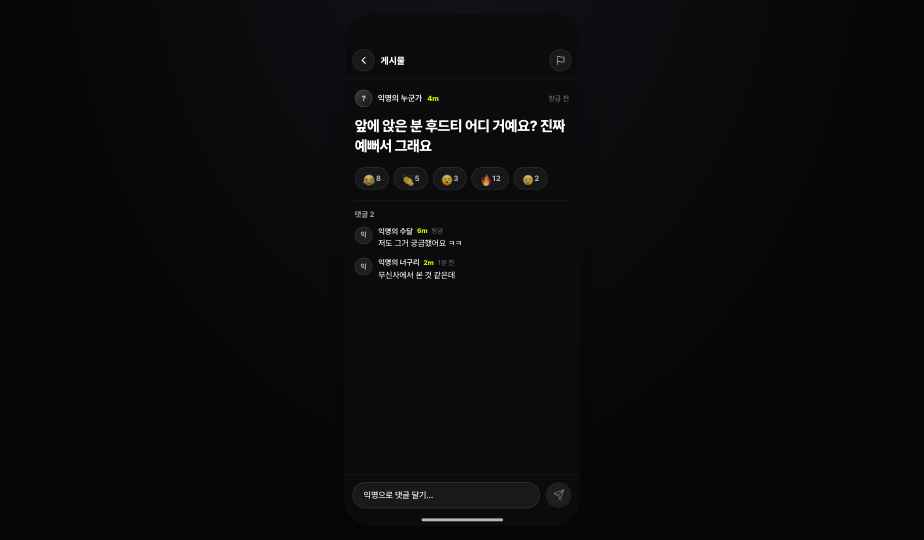

# TMI Nearby

반경 안의 짧은 TMI와 양자택일 투표를 익명으로 넘겨보는 모바일 웹 프로토타입입니다.  
같은 공간에 있지만 서로 말을 걸기는 애매한 순간, 아주 가볍게 주변의 분위기와 이야기를 볼 수 있는 앱을 상상했습니다.



[](https://github.com/sunwoo8478/tmi-nearby/actions/workflows/ci.yml)


## 프로젝트 한 줄 소개

TMI Nearby는 “지금 내 주변 사람들은 무슨 쓸데없는 생각을 하고 있을까?”에서 시작한 위치 기반 익명 마이크로 피드입니다.  
반경 안의 익명 카드들을 넘겨보고, 마음에 들면 반응하고, 댓글을 남기거나 직접 TMI/투표를 올릴 수 있습니다.

## 왜 만들었나

일반 SNS는 너무 넓고, 지역 커뮤니티는 너무 무겁습니다.  
이 프로젝트는 같은 카페, 학교, 회사, 행사장처럼 “같은 공간에 있는 사람들” 사이에서만 통하는 가벼운 이야기를 다루는 서비스를 가정했습니다.

| 문제 | 접근 |
| --- | --- |
| 실명 커뮤니티는 부담스럽다 | 매일 바뀌는 익명 닉네임을 전제로 설계 |
| 일반 SNS는 맥락이 너무 넓다 | 반경 기반으로 가까운 글만 보여주는 컨셉 |
| 긴 글은 피로하다 | 카드 한 장에 짧은 TMI 또는 투표만 표시 |
| 댓글은 필요하지만 화면을 깨면 안 된다 | 하단 시트 형태로 상세/댓글을 분리 |
| 포트폴리오에서 바로 보여야 한다 | 의존성 없는 정적 앱으로 실행 가능하게 구성 |

## 디자인 미리보기

| Feed | Detail / Comments |
| --- | --- |
|  |  |

| Comments view | App mood |
| --- | --- |
|  |  |

## 핵심 기능

| 기능 | 설명 |
| --- | --- |
| Nearby card feed | 실제 위치 기반 거리 계산으로 반경 안의 익명 TMI와 투표를 카드 스택으로 표시 |
| Swipe / Like / Nope | 버튼 또는 드래그 스와이프로 카드를 빠르게 넘기거나 좋아요 처리 |
| Vote card | “A vs B” 형태의 가벼운 양자택일 투표 |
| Comment sheet | 글의 맥락을 유지한 채 하단 시트에서 댓글 확인과 작성 |
| Compose sheet | TMI 또는 투표 형식으로 새 글 작성, localStorage 임시 저장 |
| Safety actions | 게시물 숨기기, 반복 신고 방지, 작성 쿨다운, 민감어/개인정보 필터 |
| Notifications | 주변 반응, 댓글, 새 투표 알림 확인과 닫기 |
| Profile | 익명 프로필, 활동 수치, 내가 올린 글 확인 |

## 사용자 흐름

```text
앱 진입
  → 반경 50m 안의 TMI 카드 확인
  → 좋아요 또는 넘기기
  → 궁금한 글은 댓글 시트 열기
  → 직접 TMI 또는 투표 작성
  → 알림과 내 활동 확인
```

## 디자인 방향

이 프로젝트는 밝고 귀여운 커뮤니티 앱보다, 밤에 켜도 부담 없는 어두운 모바일 피드에 가깝게 잡았습니다.

| 요소 | 의도 |
| --- | --- |
| Dark glass | 익명성과 야간 사용감을 살리는 어두운 배경 |
| Lime accent | 실시간 반경, 좋아요, 작성 버튼을 한 번에 인지 |
| iOS device frame | 모바일 앱 프로토타입이라는 맥락을 즉시 전달 |
| Card stack | “근처 이야기들을 넘겨본다”는 행동을 시각화 |
| Bottom sheet | 댓글/작성 화면이 피드를 완전히 끊지 않도록 설계 |
| Short copy | 사용자가 길게 읽기보다 빠르게 훑는 경험을 우선 |

## 구현 포인트

| 포인트 | 설명 |
| --- | --- |
| Static-first | 프레임워크 없이 HTML, CSS, JavaScript만으로 구성해 GitHub Pages에 바로 배포 가능 |
| Data layer | `src/data.js`로 mock data를 분리하고 사용자 작성 글은 localStorage에 임시 저장 |
| Location utility | `src/geo.js`에서 Geolocation, 하버사인 거리 계산, 거리 포맷, 주변 좌표 생성을 분리 |
| Mobile interaction | 포인터 이벤트 기반 카드 드래그, 바텀시트 애니메이션, safe-area 대응 |
| Safety basics | `escapeHtml()` 기반 XSS 방지, 작성 쿨다운, 민감어/전화번호 필터, 숨김/신고/차단 처리 |
| PWA ready | `manifest.webmanifest`, theme color, iOS 홈 화면 메타를 추가 |

## 기술 스택

| 영역 | 사용 |
| --- | --- |
| Markup | HTML, PWA manifest |
| Style | CSS, responsive layout, glassmorphism, safe-area |
| Interaction | Vanilla JavaScript, Pointer Events, Geolocation API, localStorage |
| Data | Mock data modules, JSDoc type comments |
| Test / CI | `node --check`, `node:test`, GitHub Actions |
| Assets | SVG favicon, README cover, screenshot assets |
| Deploy target | GitHub Pages compatible static app |

## 실행 방법

의존성 없이 바로 실행할 수 있습니다.

```bash
python3 -m http.server 5173
```

브라우저에서 `http://localhost:5173`을 엽니다.

또는 패키지 스크립트를 사용할 수 있습니다.

```bash
npm run dev
```

## 검증

```bash
npm run check
npm test
```

## 프로젝트 구조

```text
.
├── index.html
├── manifest.webmanifest
├── src/
│   ├── app.js
│   ├── data.js
│   ├── geo.js
│   ├── geo.test.mjs
│   └── styles.css
├── assets/
│   ├── favicon.svg
│   ├── readme-cover.svg
│   └── shots/
├── .github/
│   └── workflows/
└── docs/
    ├── BACKEND.md
    ├── DESIGN.md
    ├── PRODUCT.md
    └── ROADMAP.md
```

## 로컬 저장소

서버 없이 동작하는 프로토타입이라, 사용자 상태는 전부 브라우저 `localStorage`에 JSON으로 저장됩니다.

| 키 | 저장 내용 |
| --- | --- |
| `tmi-nearby:userPosts` | 사용자가 직접 작성한 TMI/투표 글 |
| `tmi-nearby:hiddenIds` | 숨김 처리한 게시물 ID 목록 |
| `tmi-nearby:blockedAuthors` | 차단한 작성자(익명 닉네임) 목록 |
| `tmi-nearby:reportedIds` | 이미 신고한 게시물 ID 목록(중복 신고 방지) |
| `tmi-nearby:reportedComments` | 이미 신고한 댓글 식별자(`${postId}-${commentIndex}`) 목록(중복 신고 방지) |
| `tmi-nearby:reportedAuthors` | 이미 신고한 작성자(익명 닉네임) 목록(중복 신고 방지) |
| `tmi-nearby:nickname` | 24시간마다 회전하는 익명 닉네임과 배정 시각 |

## 앞으로 붙이면 좋은 기능

- WebSocket 기반 실시간 카드 수신
- Supabase/Firebase 기반 익명 세션과 서버 저장소
- 댓글/투표/반응 API 연동
- 운영자 moderation 대시보드
- 위치 정확도 안내와 권한 거부 시 대체 UX
- 스크린샷과 설치형 PWA 실기기 QA 보강

## 문서

- [Product Notes](./docs/PRODUCT.md)
- [Roadmap](./docs/ROADMAP.md)
- [Backend Candidate](./docs/BACKEND.md)
- [Contributing](./CONTRIBUTING.md)
